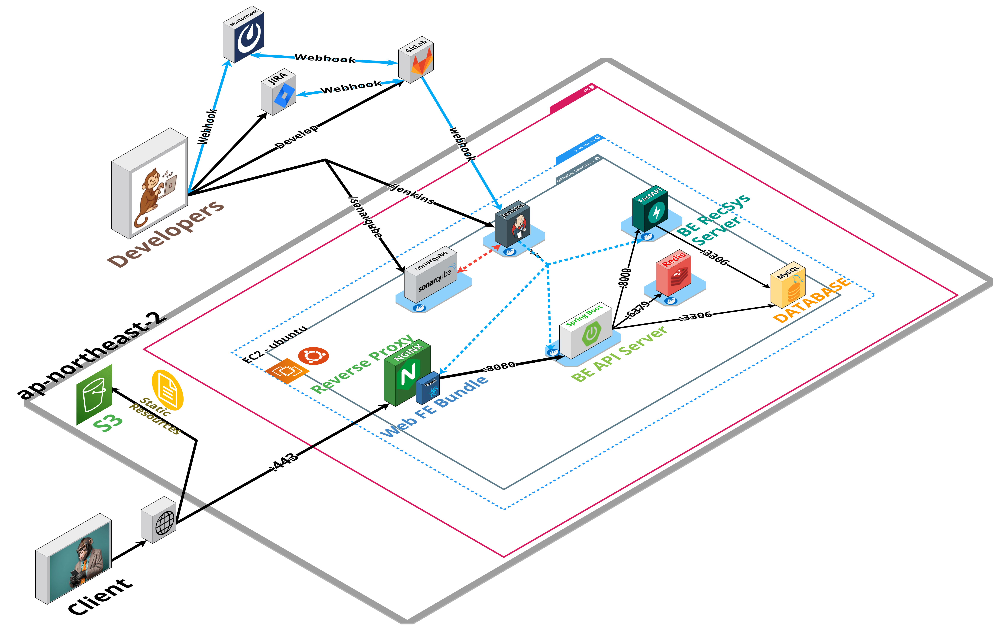
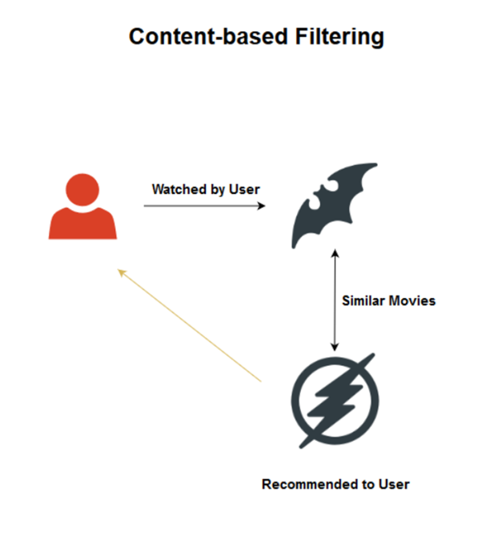
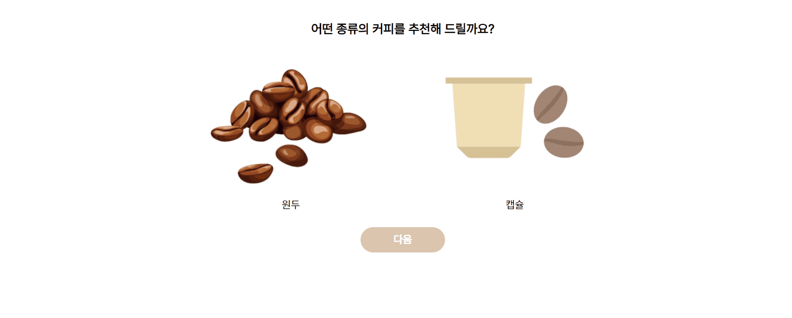
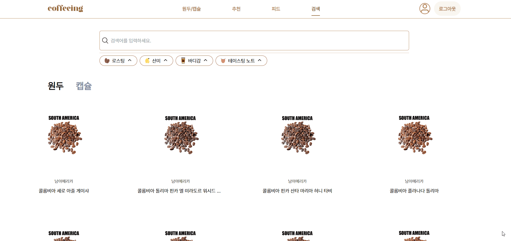

  

<h1 align="middle"><a href="https://github.com/Six-Sibling-Nagging-Barrage/PRODUCE606">원두와 캡슐 추천 서비스</a></h1>

원두와 캡슐을 추천 받고 사용자들과 소통을 통해 재미를 찾아가세요!

## 💬 서비스 소개

`coffeeing`는 원두와 캡슐을 추천 받을 수 있는 서비스입니다. 키워드 기반 큐레이션, 나만의 커피 취향을 분석할 수 있으며 사용자들과 피드를 통해 커뮤니케이션할 수 있습니다.

## 🙌🏻 멤버

|                                         Backend                                          |                                          Backend                                          |                                          Backend                                          |                                         Backend                                         |                                        Frontend                                         |                                         Frontend                                         |
| :--------------------------------------------------------------------------------------: | :---------------------------------------------------------------------------------------: | :---------------------------------------------------------------------------------------: | :-------------------------------------------------------------------------------------: | :-------------------------------------------------------------------------------------: | :--------------------------------------------------------------------------------------: | 
|  |  |  |  |  |  |
|                      [김한성(팀장)](https://github.com/khs960616)                      |                         [백승윤](https://github.com/inputTitleHere)                          |                         [신현철](https://github.com/moonn6pence)                          |                          [김태용](https://github.com/YongsHub)                          |                          [김현아](https://github.com/hyuna333)                           |                        [김하늘](https://github.com/hanulkimm)                        |

  

## 💻 Communication Tool

##    

  

## ⚙️ SKILL STACK

### 🧷 프론트엔드

     

**Language |** Typescript

**Framework |** React 18.2.0

**Engine |** Node 18.x.x

**Library |** Redux 8.1.2, Tailwind CSS 3.3.3, Axios 1.5.0

  

### 🧷 백엔드

     

**Language |** Java 17

**Framework |** Spring Boot 2.7

**Data(RDBMS) |** Spring-Data-JPA 2.7.14, MySQL 8.0, Query DSL 5.0

**Cache |** Redis 2.7.14

**Build Tool |** Gradle 8.3

**Test |** Junit 5.8.2, Mockito 4.5.1, JaCoCo 0.8.10
  
### 🧷추천 서버
    

**Language |** Python 3.11.4

**API |** Fast API 0.103.1

**ETC |** numpy 2.6.3, pandas 2.1.1, scikit-learn 1.3.1, sqlalchemy 2.0.21, uvicorn 0.23.2, python-dotenv 1.0.0,    scikit-surprise 1.1.3

  
### 🧷 인프라

       

**Infra |** AWS EC2, Nginx, Sonarqube

**DB |** H2, MySQL 8

**CI/CD |** Git, Jenkins

  

## 🏬 프로젝트 아키텍쳐

### Infrastructure

---

### 🦊 원두와 캡슐 추천은 콘텐츠 기반 추천을 활용했습니다!
 

콘텐츠 기반 추천

 
 

### 🐼 당신을 위한 특별한 한 잔! Coffeeing 과 함께 하세요

나의 취향을 통해 `원두와 캡슐을 추천 받아보세요`

추천 알아보기

 
 

### 🐻 선호도에 따른 큐레이션을 함께 하세요

`로스팅, 바디감 산미, 나이 대 등등 나의 취향 분석 큐레이션을 제공 받을 수 있습니다!`

메인페이지 큐레이션 알아보기

 
 

### 🐒 찾고 싶은 원두 또는 캡슐이 있을까요? 검색 필터링을 통해 찾아보세요!

`로스팅, 산미, 바디감, 테이스팅 노트, 검색어를 통해 원하는 정보를 확인할 수 있습니다!`

검색 알아보기

 
 

### 🐸 피드를 통해 사람들의 취향을 확인하고 일상을 공유하세요!

`사람들이 즐겨 먹는 원두나 캡슐을 볼 수 있으며 일상을 나누는 즐거움을 느낄 수 있습니다!`

피드 알아보기

 
 
